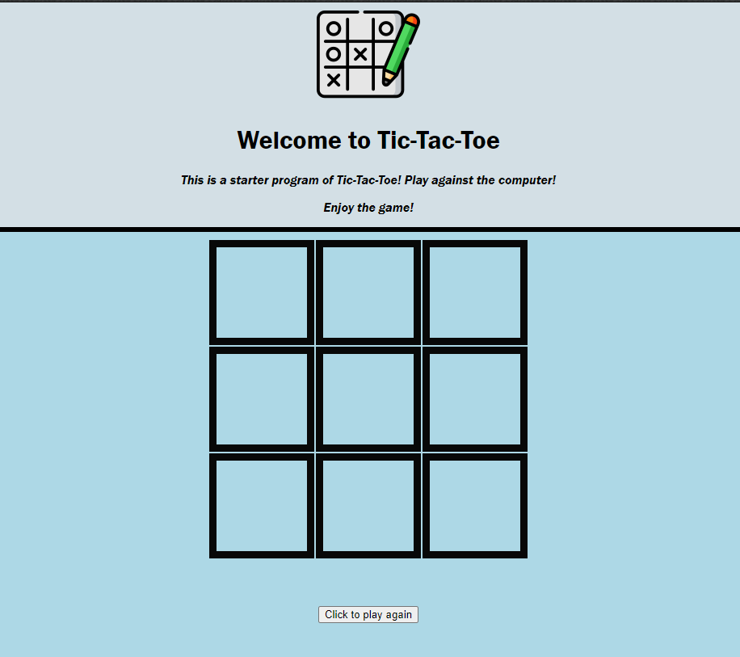

The screenshot below is a tic-tac-toe board I created to be pushed onto a cloud service. The board was built using Python and Django for the framework necessary to make it clickable and run without any major hiccups. It also required knowledge in HTML and CSS in order bring the board effects and colors to light.

The project used Heroku for its cloud provider, and can still be viewed using the following [link] (https://vmosley-tictactoe.herokuapp.com).

